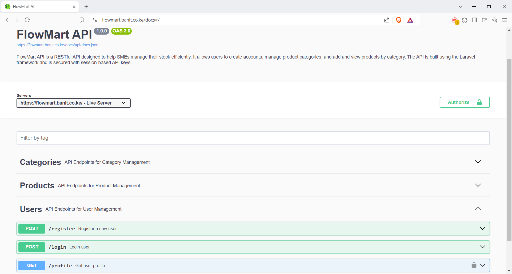

# FlowMart API

FlowMart API is a RESTful API designed to help SMEs manage their stock efficiently. It allows users to create accounts, manage product categories, and add and view products by category. The API is built using the Laravel framework and is secured with session-based API keys.

## Features

-   **Create an Account**: Allows users to register new accounts.
-   **Login to Account**: Provides user authentication and generates an API key for authenticated sessions.
-   **Create a Product Category**: Allows users to create product categories for better stock organization.
-   **Create Products for a Category**: Lets users add products under specific categories.
-   **Display Products by Category**: Retrieves and displays all products in a specific category.
-   **Fetch All Categories**: Retrieves and displays all product categories.
-   **Fetch All Products**: Retrieves and displays all products across all categories.

## Getting Started

### Prerequisites

-   PHP >= 8.2
-   Composer
-   Laravel 11.x
-   MySQL or other supported database
-   Postman or cURL for API testing

### Installation

1. Clone the repository:

    ```bash
    git clone https://github.com/yourusername/flowmart-api.git
    ```

2. Navigate to the project directory:

    ```bash
    cd flow-mart-api
    ```

3. Install dependencies:

    ```bash
    composer install
    ```

4. Copy `.env.example` to `.env` and configure your environment settings:

    ```bash
    cp .env.example .env
    ```

    Update the following parameters in your `.env` file:

    - `DB_DATABASE`: The name of your MySQL database.
    - `DB_USERNAME`: Your database username.
    - `DB_PASSWORD`: Your database password.

5. Generate an application key:

    ```bash
    php artisan key:generate
    ```

6. Run database migrations:

    ```bash
    php artisan migrate
    ```

7. Start the Laravel development server:

    ```bash
    php artisan serve
    ```

    The API will be available at `http://localhost:8000`.

### Authentication

Authentication is done via API key, which is generated upon user login. The API key must be passed in the `Authorization` header for all requests that require authentication.

```http
Authorization: Bearer {API_KEY}
```

## API Documentation

To help you get started and effectively integrate with our platform, comprehensive API documentation is available. This documentation provides detailed information about all available endpoints, request and response structures, authentication methods, and example usage scenarios.

### Access the API Documentation

You can explore the interactive API documentation through Swagger UI by visiting the following link:

🔗 **[FlowMart API Documentation](https://flowmart.banit.co.ke/docs)**



### Accessing the API

FlowMart API is an open API, and developers can access it using the following base URL:

```
https://flowmart.banit.co.ke/
```

All API endpoints described above can be accessed by appending the relevant paths to this base URL. For example, to fetch all product categories, you would use:

```
GET https://flowmart.banit.co.ke/categories
```

Ensure to include any necessary authentication tokens, where required, as per the endpoint descriptions.

## License

This project is licensed under the MIT License. See the [LICENSE](LICENSE) file for details.
